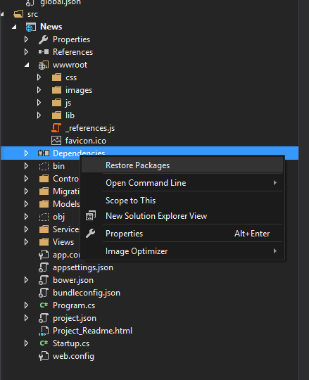
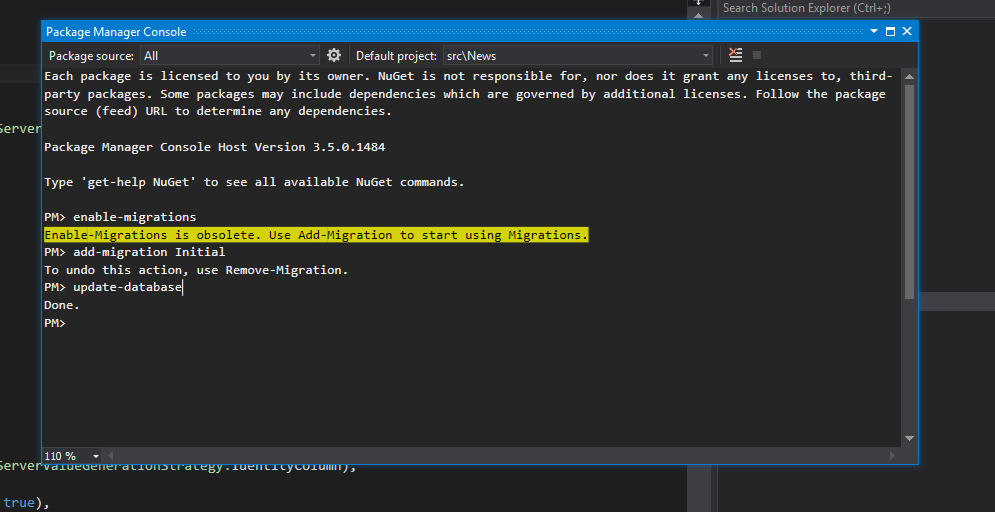

# DeveloperAssessmentProject
A News Article Project with .net core

<h3><b>Information</b></h3>

The Developer Assignment is written in Visual Studio 2015 with Update3 using Asp.NET Core (.net Framework 4.6.1). For simplicity, local database is selected as development database with code-first approach. Database models are created under Models folder. There exists a <b>NewsContext</b> class which encapsulates entities for Database.

Connection string is defined as <b>DefaultConnection</b> in <b>ConnectionStrings</b> which is a part of the <b>appsettings.json</b> file.

In order to provide some good level of user experience, bootstrap framework is used.

For chart example, <b>chart.js</b> library is used.

<h3><b>Requirements</b></h3>

To run application properly <a href="https://go.microsoft.com/fwlink/?LinkID=827546">NET Core tools Preview 2 for Visual Studio 2015</a>  must be installed.

<b>Database: (localdb)\MSSQLLocalDB </b>: Install SQL Server 2016 Express with LocalDB option with MSSQLLocaldDB as instance name. Or any other Sql Server instance can be used by changing the <b>ConnectionString</b> in <b>appsettings.json</b>.

All required libraries are referenced in the <b>dependencies</b> section of <b>project.json</b> file (which is restored when file saved). Also third party libraries used in this project are referenced in the <b>dependencies</b> section of <b>bower.json file</b> (bower.json is kept hidden by default) and when project is loaded in Visual Studio bower refreshes dependencies (meaning downloads third party libraries into <b>wwwroot/lib</b> folder). If not; please after opening the project in Visual Studio, right click on Dependencies folder and click on <b>Restore Packages</b> as shown below.

<h3><b>EF Migrations</b></h3>

In order to create Database for the project; following commands should be executed from Package Manager Console (VisualStudio/Tools/Package Manager Console):

 PM> Enable-migrations 
 PM> add-migration [MigrationName]  
 PM> update-database 
 
For demonstration purposes; there exists a <b>Seed.cs</b> class under Models folder which ensures whether the database is created (if not it creates database) and it seeds the database. Simply hit the f5 button; then News DB will be created (if it doesn’t already exists) and the Article table will be filled with the seed data.

